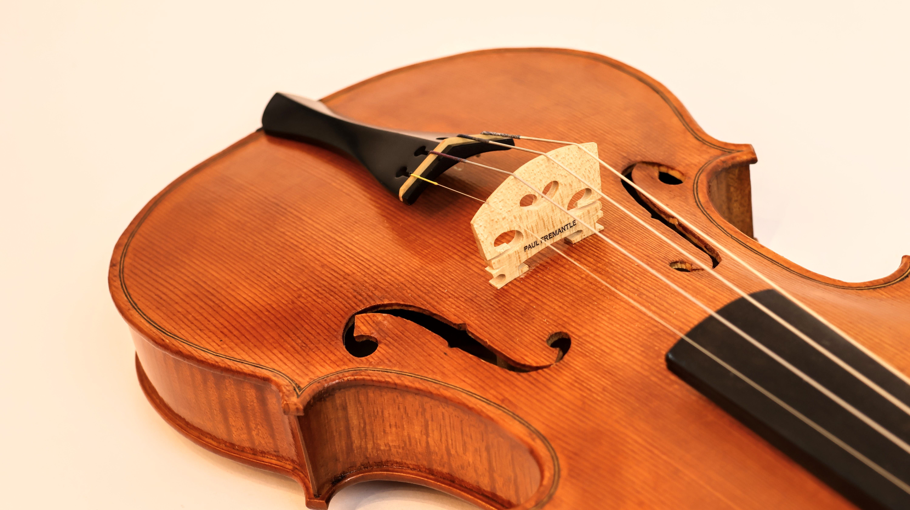

    

      
      
Scottish Fiddle after Matthew Hardie c.1800

    

 

<a href="/about">about</a>  / <a href="/gallery">gallery</a> /  <a href="https://paulfremantleluthier.substack.com/archive">blog</a>

